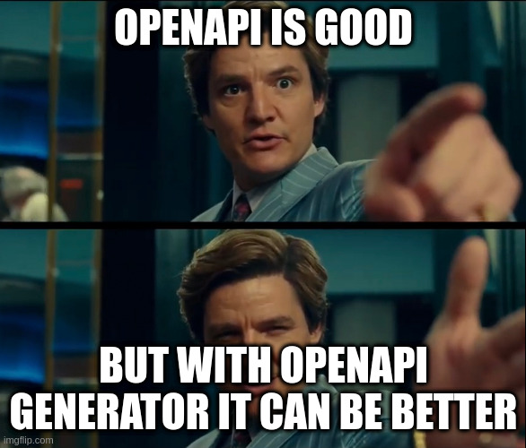

# Short and sweet

## Intro to OpenAPI Generator

---

# Intro, reason & background

---

# OpenAPI

* https://swagger.io/specification/
* https://swagger.io/docs/specification/about/
* https://editor.swagger.io/

---

# OpenAPI Generator

* https://openapi-generator.tech/
* https://github.com/OpenAPITools/openapi-generator

---

# OpenAPI Generator

* modules/openapi-generator: src/main/java `DefaultGenerator.java`
* modules/openapi-generator: src/main/resources `<lang/library>`
  * mustache templates, see https://mustache.github.io/

---

# Demo

## Current project

NDA: contract-first `openapi.yaml` + `openapi-generator-maven-plugin`

<!--
Code will be shown, but not shared.
-->

---

# Demo

## `@GZIP` support for Quarkus

https://github.com/OpenAPITools/openapi-generator/pull/13983

---

# Q&A